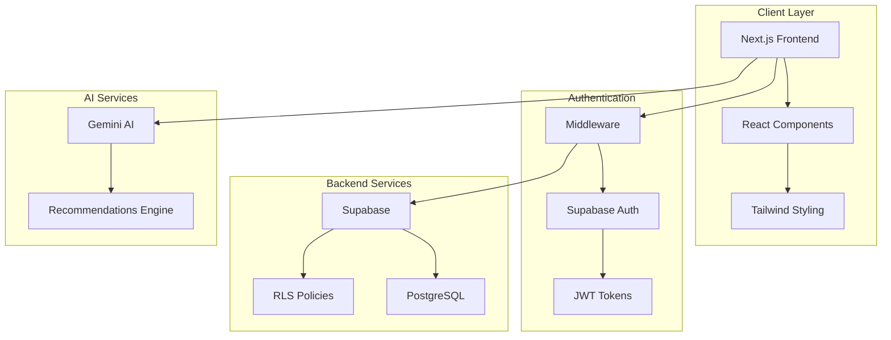
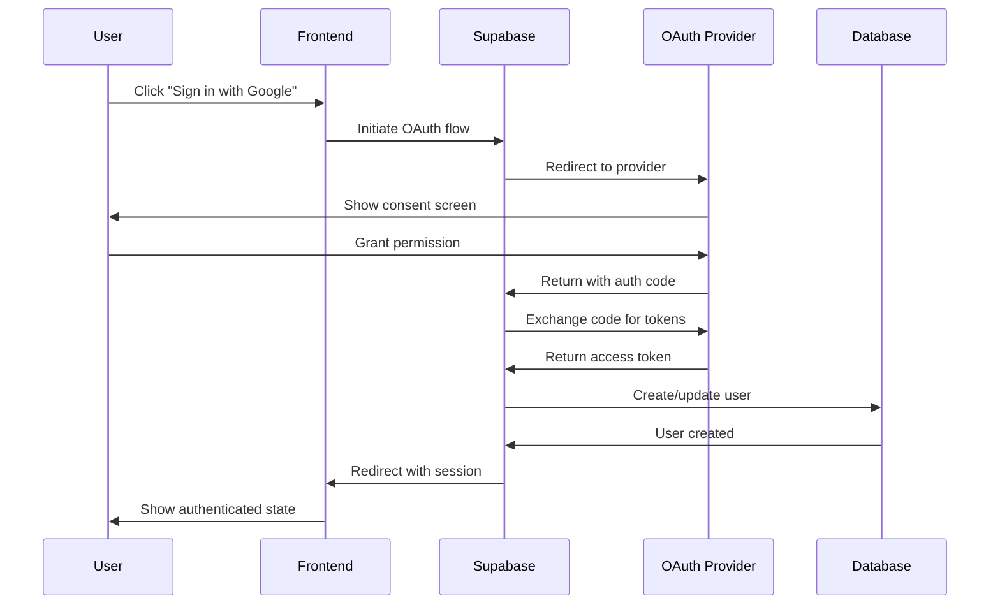
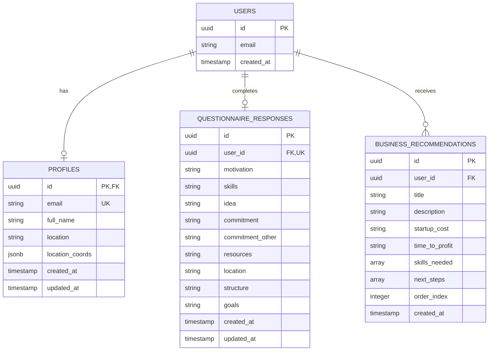

# FedVentura - AI-Powered Entrepreneurship Platform

**Empowering displaced workers to transition into successful entrepreneurs through AI-driven personalized guidance.**

[Live Demo](https://fedventura.vercel.app) | [Features](#-features) | [Tech Stack](#-tech-stack) | [Getting Started](#-getting-started)

## 📋 Overview

FedVentura is a comprehensive web platform designed by two students interning under Growth Sector - San Jose State University to assist recently displaced federal workers and laid-off employees in transitioning to entrepreneurship. By leveraging advanced AI technology and a curated resource ecosystem, the platform provides personalized business recommendations, skill-matched learning paths, and access to critical entrepreneurial resources.

### 🎯 Key Objectives

- **Personalized AI Guidance** - Intelligent business recommendations based on individual skills and goals
- **Resource Accessibility** - Centralized hub for funding, mentorship, and educational resources
- **Location-Aware Services** - Local resource recommendations with geolocation integration
- **Persistent User Experience** - Secure data storage with real-time synchronization

## ✨ Features

### Core Functionality

#### 🤖 AI-Powered Business Recommendations
- Integration with Google Gemini 2.0 Flash for advanced language processing
- Generates 3 personalized business ideas with startup costs, timelines, and actionable steps
- Context-aware analysis based on user's skills, experience, and constraints
- Fallback mechanisms ensuring reliability

#### 📚 Dynamic Learning Paths
- AI-curated course recommendations across three proficiency levels
- Direct integration with LinkedIn Learning, Udemy, and Coursera
- Smart search functionality with provider-specific redirects
- Skill-based course matching

#### 🗂️ Comprehensive Resource Directory
- 8 distinct categories: Funding, Networking, Bootcamps, Mentorship, Workspace, Tools, Legal, Local
- Advanced filtering with real-time search
- Location-based prioritization using browser geolocation
- 20+ curated resources with detailed information

#### 🔐 Secure Authentication System
- Email/password and OAuth authentication (Google, Facebook)
- JWT-based session management
- Protected routes with middleware
- Automatic profile creation on signup

## 🛠️ Tech Stack

### Frontend
- **Next.js 14** - React framework with App Router for optimal performance
- **TypeScript** - Type-safe development with enhanced IDE support
- **Tailwind CSS** - Utility-first styling with custom design system
- **Radix UI** - Accessible headless components
- **Lucide React** - Comprehensive icon library

### Backend
- **Supabase** - PostgreSQL database with real-time subscriptions
- **Row Level Security** - Database-level access control
- **Edge Functions** - Serverless API endpoints
- **Middleware** - Route protection and authentication

### AI & External Services
- **Google Gemini AI** - Natural language processing for recommendations
- **OpenStreetMap Nominatim** - Reverse geocoding for location services
- **OAuth 2.0** - Social authentication providers

## 🏗️ Architecture

## 🔐 Authentication Flow
### OAuth 2.0 Flow Diagram

## 🗄️ Database Schema
### Entity Relationship Diagram

## 🎨 Design System

- Color Palette: Primary (#0D5FBD), Secondary (#006666), Accent (#FDB813)
- Typography: Inter font family with responsive sizing
- Components: Consistent design language with Tailwind utilities
- Responsive: Mobile-first approach with all breakpoints covered

## 🚦 Performance Optimizations

- Server-side rendering for initial page loads
- Dynamic imports for code splitting
- Image optimization with Next.js Image component
- Database indexing on foreign keys
- Memoized expensive computations

## 🔒 Security Measures

- Row Level Security (RLS) policies
- JWT token validation
- Input sanitization
- CORS configuration
- Environment variable protection

## 👥 Contributors

Lynn T. Aung - Full Stack Developer & Technical Lead
Paola Ayala - UI/UX Designer & Project Coordinator

## 📄 License
This project is licensed under the MIT License.

  
Built with ❤️ by the FedVentura Team

  

    <a
